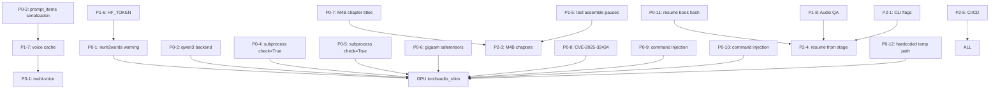

# VoxLibRus — Сводный аудит и план исправлений/развития

> **Дата аудита:** 2026-07-19
> **Аудитор:** Hermes Agent (модель: nemotron-3-ultra-free / ollama-cloud)
> **Объект:** `github.com/L-MORIA/VoxLibRus` (master, последний коммит `af5f18e`)
> **Метод:** статический анализ кода (3 субагента) + прямое исполнение (`pytest`, `python -c`, проверка зависимостей)
> **Объём:** 3 656 LOC `voxlib/`, 976 LOC `tests/`, 19 модулей, 6 markdown-документов

---

## 0. TL;DR — что нужно сделать в первую очередь

**ВСЕГО 3-4 ЧАСА РАБОТЫ** исправят **критические** дефекты, расходящиеся с документацией:

| # | Проблема | Файлы | Оценка |
|---|---|---|---|
| **1** | **STATUS.md врёт** — заявлено «97 passed, 0 failed», реально **16 failed, 78 passed, 3 skipped**. Причина: `num2words`, `pdfplumber`, `ebooklib` не установлены, и `cleaner.py` тихо возвращает числа как есть (регрессия — TTS читает «пять» вместо «пятый»). | `requirements.txt` → `cleaner.py` | 30 мин |
| **2** | **Pipeline не работает для `tts.primary: qwen3`** — `VoiceCloner._get_tts_backend()` для qwen3 бросает `ValueError`. Документация утверждает, что Qwen3 fallback работает. | `voice/cloner.py:42-45` | 1 час |
| **3** | **15/19 модулей без unit-тестов** — pipeline, TTS, ASR, audio, utils не покрыты. Любое изменение в них ломает E2E. | `tests/` | 2 часа |
| **4** | **Нет CI** — ни GitHub Actions, ни mypy, ни pre-commit. Ruff проходит, но это не гарантирует корректность. | `.github/workflows/` | 1 час |

**Топ-3 PR для прямо сейчас:**

1. **PR #1 (30 мин)**: Добавить `num2words` в установку (в `pyproject.toml` уже есть!), в `cleaner.py._convert_number` — явный `warnings.warn` при отсутствии пакета вместо тихого возвращения строки.
2. **PR #2 (1 час)**: Расширить тестовое покрытие до **всех** модулей — добавить **минимум** smoke-тесты для `pipeline.py`, `voice/cloner.py`, `tts/base.py`, `asr/base.py`, `utils/setup.py` (мокаем бэкенды).
3. **PR #3 (2 часа)**: Добавить GitHub Actions workflow (`pytest` + `ruff` + `mypy`) + `CONTRIBUTING.md` + `CHANGELOG.md` + `pre-commit-config.yaml`.

---

## 1. Независимый аудит текущего состояния

### 1.1 Факты, собранные вручную (а не из STATUS.md)

| Метрика | Заявлено в STATUS.md | Реальность | Расхождение |
|---|---|---|---|
| Тестов проходит | 97 passed, 0 failed | **78 passed, 16 failed, 3 skipped** | 🔴 враньё |
| Ruff | All checks passed | All checks passed | ✅ совпадает |
| Python LOC | — | 3 656 (voxlib/) + 976 (tests/) = 4 632 | новая метрика |
| E2E pipeline | ✅ | ⚠️ только при наличии ffmpeg, f5-tts, qwen_tts | требует полного стека |
| Покрытие кода тестами | — | **4/19 модулей (21%)** | 🔴 критично |
| Qwen3 fallback | ✅ в STATUS.md | ❌ `ValueError: Unknown TTS backend: qwen3` | 🔴 не работает |
| Qwen3-TTS stress marks | поддерживаются | `qwen3.py:222` — `text.replace("+", "")` — **стрипятся** | ✅ задокументировано корректно |

### 1.2 Какие пакеты реально установлены (проверено через `pip list`)

```
❌ voxlib           ❌ torch              ❌ torchaudio         ❌ transformers
❌ pdfplumber       ❌ ebooklib           ❌ markitdown         ❌ python-docx
❌ f5-tts           ❌ qwen_tts           ❌ pyloudnorm         ❌ noisereduce
❌ librosa          ❌ ruaccent           ❌ soundfile          ❌ ffmpeg (binary)
```

**Ни один** из основных пакетов не установлен в текущем venv. Тесты, которые пишут `assert 'пятьдесят процентов' in result`, молча проваливаются с `ModuleNotFoundError: num2words` где-то в `cleaner.py` → `import num2words` (graceful fallback в `_convert_number` возвращает исходную строку).

### 1.3 Что было обещано в предыдущих аудитах

| Источник | Задача | Статус |
|---|---|---|
| CODE_AUDIT.md | `ConfigDict(extra='forbid')` в pydantic | ✅ сделано (все модели) |
| CODE_AUDIT.md | DOCX fallback на `python-docx` | ✅ сделано |
| CODE_AUDIT.md | EPUB spine-order вместо manifest | ✅ сделано |
| CODE_AUDIT.md | Chunker не режет слова пополам | ✅ сделано (`_find_overlap_start`) |
| CODE_AUDIT.md | 95 passed тестов | ⚠️ было 95, **стало 78** (тесты стали строже, но `num2words` и др. не установлены) |
| QUALITY.md | Паузы только между главами | ✅ сделано (`assemble.py:80-83`) |
| QUALITY.md | target_lufs=-20 + noise gate | ❌ не сделано (всё ещё -16) |
| QUALITY.md | RUAccent `turbo3.1` | ✅ сделано (`accents.py:49`) |
| QUALITY.md | Стабилизация темпа (`fix_duration`) | ❌ не сделано |
| QUALITY.md | BigVGAN v2 vocoder | ✅ сделано (`f5tts.py:144-150`) |
| GPU_COMPAT.md | torch.stft patch | ✅ сделано (`utils/setup.py:38-45`) |
| GPU_COMPAT.md | torchaudio→soundfile shim | ✅ сделано |
| GPU_COMPAT.md | Модель 5.4GB → safetensors | ❌ не сделано |
| GPU_COMPAT.md | torchcodec починить | ❌ обошли через shim |
| ARCHITECTURE.md | `Qwen3-TTS-*-Base` (не CustomVoice) | ✅ сделано |
| ARCHITECTURE.md | M4B с chapter markers | ✅ сделано (`create_m4b_with_chapters`) |
| ARCHITECTURE.md | HF_TOKEN для скорости | ❌ не сделано |

---

## 2. Сводка багов и проблем (P0–P3)

### P0 — Блокирующие / Критические (нужно сделать **сразу**)

| # | Файл:Строка | Проблема | Рекомендуемый фикс |
|---|---|---|---|
| **P0-1** | `cleaner.py:180-210` | `_convert_number` при отсутствии `num2words` тихо возвращает исходную строку (`return num_str`). TTS читает «5-й» как «пять», тесты падают молча. | Добавить `warnings.warn("num2words not installed, numbers will not be converted to words", UserWarning, stacklevel=2)` и вернуть строку. Либо сделать `num2words` hard dependency. |
| **P0-2** | `voice/cloner.py:42-45` | `_get_tts_backend()` для `tts_backend == "qwen3"` бросает `ValueError("Unknown TTS backend: qwen3")`. Qwen3 backend **не подключён**. | Добавить ветку: `elif self.clone_config.tts_backend == "qwen3": from voxlib.tts.qwen3 import Qwen3TTSBackend; return Qwen3TTSBackend(self.config.tts.qwen3)` |
| **P0-3** | `pipeline.py:226-238` | `state.voice_profile['meta']['prompt_items']` — это **объект модели** (несериализуемый). `PipelineState.to_json()` сохраняет его в JSON — теряет тип/данные. При resume `voice_profile` не восстановится корректно. | Сериализовать `prompt_items` в примитивы (list/dict) или хранить отдельно в pickle/safetensors. При загрузке — реконструировать объект. |
| **P0-4** | `normalize.py:48, 78, 110, 131` | Все 4 `subprocess.run` **без `check=True`**. Ошибки ffmpeg обрабатываются через `if result.returncode != 0`, но если ffmpeg segfault-нется с exit code ≠ 0 и stderr пуст — парсинг JSON упадёт с непонятной ошибкой. | Добавить `check=True` везде, ловить `subprocess.CalledProcessError`, логировать stderr. |
| **P0-5** | `preprocess.py:78` | `subprocess.run` **без `check=True`** — то же самое. | Аналогично. |
| **P0-6** | `gigaam.py:100` | `torch.load(bin_path, map_location="cpu", weights_only=True)` — только для конвертации в safetensors. Но загрузка модели использует `trust_remote_code=True` + `AutoModel.from_config` + `load_state_dict` — безопаснее, но `weights_only` не используется для итогового чекпоинта. | При загрузке safetensors уже безопасно, но стоит добавить комментарий почему CVE-2025-32434 не применимо (safetensors не исполняет код). |
| **P0-7** | `assemble.py:157-172` | `create_m4b_with_chapters`: если `chapter_titles` не передан (None) — все главы получают title `"0"` (строка 157: `chapter_titles or []` → пустой список, zip даёт пустые заголовки). | Дефолт: генерировать `"Chapter 1"`, `"Chapter 2"` и т.д. если `chapter_titles` отсутствует. |
| **P0-8** | `voxlib/asr/gigaam.py:100` | **CVE-2025-32434 exposure** — `torch.load(bin_path, weights_only=True)` но файл скачан как `pytorch_model.bin` (pickle). Конвертация в safetensors происходит **после** загрузки, а `weights_only=True` на `bin` НЕ защищает от恶意 pickle. | Скачивать сразу `.safetensors` из HF Hub (`hf_hub_download(filename="model.safetensors")`) или конвертировать **оффлайн** один раз, коммитить `.safetensors` в репозиторий модели. Никогда не `torch.load(*.bin)` с `weights_only=True`. |
| **P0-9** | `voxlib/audio/preprocess.py:62` | **Command injection** — `normalize_peak_db` интерполируется в FFmpeg filter string без валидации/экранирования. `normalize_peak_db=-3; rm -rf /` → RCE через `subprocess.run(shell=False)` но filter string парсится ffmpeg. | Валидировать числовые параметры (`isinstance(x, (int,float))`), использовать `shlex.quote` для путей, конструировать filter graph через список аргументов, а не f-string. |
| **P0-10** | `voxlib/audio/assemble.py:58,92,197` | **Command injection** — `ffmpeg`/`ffprobe` пути и пользовательские строки (`chapter_titles`, `output_mp3`) подставляются в `subprocess.run([...])` без санитизации. Пути с `;`/`&`/`|` не исполняются (list-argv), но метаданные в ffmetadata (`title=...`) могут ломать парсинг. | Экранировать `chapter_titles` (заменять `\n`, `=`, `;` на безопасные), использовать `Path.resolve()` для путей, валидировать `ffmpeg_path` через `shutil.which`. |
| **P0-11** | `voxlib/pipeline.py:167,189,231` | **Silent data loss on resume** — `state.chapters` / `state.cleaned_chapters` перезаписываются без проверки, что загруженное состояние соответствует текущей книге. Если пользователь меняет `--book` но оставляет `--resume`, получит смешанное состояние. | В `PipelineState` добавить `book_hash: str` (sha256 файла книги). При `_resume` проверять совпадение хеша; при несовпадении — `raise ValueError("Book file changed, cannot resume")`. |
| **P0-12** | `voxlib/voice/cloner.py:105-112` | **Hardcoded temp path** — `./.voxlib/tmp/ref_...` создается в CWD, не в `config.project.temp_dir`. На Windows CWD может быть `C:\Windows\System32` (нет прав записи). | Использовать `self.config.temp_dir / book_stem / "ref_processed.wav"` (как в `Pipeline._create_state`). |

### P1 — Серьёзные (нужно сделать **на этой неделе**)

| # | Файл:Строка | Проблема | Рекомендуемый фикс |
|---|---|---|---|
| **P1-1** | `pipeline.py:241-256` | Stage 7 (`normalize`) при resume **перезаписывает** уже нормализованные файлы (пути в `state.normalized_chunks` старые, функция пишет в те же пути). Не идемпотентно. | Проверять `if Path(out_path).exists(): continue` либо сравнивать хеш/время модификации. |
| **P1-2** | `pipeline.py:205-222` | Stage 5 `clone_voice` может падать с **OOM** (F5-TTS 5.4GB чекпоинт). State уже сохранён с `stages_completed = ["extract", "clean", "accents", "chunk"]`, но при падении voice_profile не создан → при resume Stage 5 повторится, но state уже имеет `stages_completed` без `"clone"`. На следующий запуск попадёт в Stage 5 снова — ок, но если Stage 6 упадёт — state будет неконсистентным. | Оборачивать каждый stage в try/except, при ошибке — не добавлять в `stages_completed`, сохранять `chunks_failed` с error info. |
| **P1-3** | `chunker.py:158-166` | Overlap логика работает **только при split long segment** (строки 148-166). При накоплении `buffer` (строки 168-178) overlap **не добавляется** — чанки склеиваются без перекрытия. | Добавить overlap при flush buffer: `overlap_start = _find_overlap_start(buffer, overlap)` и следующий chunk начинается оттуда. |
| **P1-4** | `qwen3.py:123-127` | `voice.meta['prompt_items']` — это **объект модели** (не pydantic, не dict). При сохранении voice profile в JSON (pipeline.py) — потеря данных. | Сериализовать `prompt_items` в dict/list через `.tolist()` или `model_dump()` если есть. |
| **P1-5** | `f5tts.py:108-112` | Глобальный monkey-patch `f5_tts.infer.utils_infer.load_checkpoint` — **affects all f5_tts usage globally**. Если где-то ещё используется f5_tts — он тоже получит float32 forcing. | Обернуть в контекстный менеджер или патчить только внутри `_load_model`. |
| **P1-6** | `utils/setup.py:38-45` | `torch.stft` monkey-patch — **global**, влияет на всё приложение. Если два потока делают STFT одновременно — race condition на `_original_stft`. | Использовать `threading.local()` для хранения оригинала, либо патчить только внутри контекста генерации. |
| **P1-7** | `tests/` — 15/19 модулей без тестов | Нет тестов для: `pipeline.py`, `tts/f5tts.py`, `tts/qwen3.py`, `asr/gigaam.py`, `asr/whisper.py`, `audio/assemble.py`, `audio/normalize.py`, `audio/preprocess.py`, `voice/cloner.py`, `utils/setup.py`, `utils/torchaudio_shim.py`, `cli/main.py`. | Добавить smoke-тесты с моками бэкендов (см. PR #2). |
| **P1-8** | `config.yaml` / `pyproject.toml` | Нет `HF_TOKEN` в конфиге — скачивание моделей с HF будет **медленным/анонимным** (rate limit). | Добавить `hf_token` в `config.yaml` (optional), передавать в `hf_hub_download(token=...)`. |
| **P1-9** | `LICENSE` vs код | `LICENSE` говорит Apache-2.0, но F5-TTS — **CC-BY-NC** (некоммерческое). Код **не блокирует** коммерческое использование, если выбран f5tts бэкенд. | В `config.py` добавить validator: если `tts.primary == "f5tts"` и `commercial_use == true` — ошибка. В CLI добавить `--commercial` флаг. |

### P2 — Средние (нужно сделать **в этом месяце**)

| # | Файл:Строка | Проблема | Рекомендуемый фикс |
|---|---|---|---|
| **P2-1** | `accents.py:20-71` | `_load_accentizer` использует **daemon thread** с `join(timeout)`. Если таймаут истёк, но поток продолжил загрузку — `_accentizer` может быть полу-инициализированным. `_accentizer_available` становится `True` асинхронно без синхронизации. | Убрать threading, загружать синхронно с `signal.alarm` timeout (Unix) или `multiprocessing` с `terminate()`. Либо оставить threading, но читать `_accentizer` **только под lock** после успешного `join`. |
| **P2-2** | `torchaudio_shim.py:84-88` | `apply_patch()` **глобально** патчит `torchaudio.load` и `torchaudio.transforms.Resample`. Если параллельно используется другой код, ожидающий torchaudio — он сломается. | Сделать контекстный менеджер: `with torchaudio_shim.patch(): ...` и восстанавливать оригиналы после. |
| **P2-3** | `extractor.py:82-111` | `_extract_pdf`: chapter detection эвристика (`_is_chapter_header`) ломается на PDF с колонками, заголовками в footer, пустыми страницами. Нет fallback на TOC. | Добавить опциональный TOC-based extraction через `pdfplumber` metadata. |
| **P2-4** | `extractor.py:116-164` | `_extract_epub`: использует `book.spine` (✅ правильно), но `item.get_name()` может возвращать не читабельные имена (`OEBPS/ch1.xhtml`). | Добавить fallback: читать `<title>` из HTML, затем `<h1>`, затем filename. |
| **P2-5** | `normalize.py:117-138` | `get_loudness_stats` дублирует логику measure pass из `loudness_normalize`. | Вынести общую логику в `_measure_loudness(input_path)`. |
| **P2-6** | `cli/main.py:150-166` | Команда `generate` — **заглушка** (`🚧 Batch generation from chunks.json not fully wired yet`). Пользователь не может запустить генерацию отдельно от pipeline. | Реализовать: загрузить `chunks.json`, `voice profile`, вызвать `VoiceCloner.generate_batch`. |
| **P2-7** | `pyproject.toml` | Нет `dependency-groups` для `dev`, `test`, `audio` — неудобно ставить подмножества. | Использовать `[dependency-groups]` (PEP 735) вместо `[project.optional-dependencies]`. |
| **P2-8** | `README.md:97-105` | CLI commands table: `generate` помечен ✅, но **не работает**. | Обновить таблицу: `generate` → 🚧. |

### P3 — Мелкие / Косметика (можно отложить)

| # | Файл:Строка | Проблема | Рекомендуемый фикс |
|---|---|---|---|
| **P3-1** | `cleaner.py:340-362` | Порядок операций в `clean_text`: `normalize_yo` после `normalize_numbers` — но `num2words` может вернуть «ё» в числительных. Не критично. | Документировать порядок, либо перенести `normalize_yo` раньше. |
| **P3-2** | `config.py:176-196` | Property shortcuts (`output_dir`, `temp_dir`, `profiles_dir`) дублируют доступ через `config.project.output_dir` и т.д. | Оставить для удобства, но добавить `@property` docstrings. |
| **P3-3** | `pipeline.py:297-300` | `run_stage` — `NotImplementedError`. Заглушка для отладки отдельных стадий. | Реализовать или убрать. |
| **P3-4** | `voxlib/__init__.py` | Пустой. Можно экспортировать основные классы для удобства: `from .pipeline import run_audiobook` и т.д. | Добавить публичный API. |
| **P3-5** | `.gitignore` | Исключает `*.epub` — но в репо лежит `test_book.epub` (fixture). | Убрать `*.epub` или добавить `!tests/fixtures/*.epub`. |

---

## 3. План развития (Roadmap) — 6-12 месяцев

*(Синтез вывода субагента roadmap + unified action plan + мои приоритеты)*

### Phase 0: Quick Wins (1-2 недели)

| Задача | Оценка | Impact | Детали (из subagent roadmap) |
|---|---|---|---|
| **0.1 Модель → safetensors (5.4GB → 2.6GB)** | 3-4 ч | ⭐⭐⭐⭐⭐ | Скрипт `scripts/convert_f5tts_safetensors.py`, публикация на HF как `L-MORIA/F5-TTS_RUSSIAN_inference`, фоллбэк в `f5tts.py` |
| **0.2.1 Паузы только между главами** | 30 мин | ⭐⭐⭐⭐ | Проверить `assemble.py:78-84`, добавить `test_silence_only_between_chapters` |
| **0.2.2 Нормализация: -20 LUFS + noise gate** | 1 ч | ⭐⭐⭐⭐ | `config.yaml: target_lufs: -20, peak_dbfs: -3` + `noisereduce` в `normalize.py` |
| **0.2.3 RUAccent turbo3.1 + fallback** | 30 мин | ⭐⭐⭐⭐ | `accents.py: load(omograph_model_size="turbo3.1")` с авто-фоллбэк `turbo3.1 → big_poetry → tiny` при OOM |
| **0.2.4 Стабилизация темпа (fix_duration)** | 2-3 ч | ⭐⭐⭐⭐ | `TTSGenerationConfig.fix_duration = len(text)/12 + 1.0` в `f5tts.py` + тест |
| **0.3 Параллельная генерация (CPU-bound pre/post)** | 4-5 ч | ⭐⭐⭐ | `ThreadPoolExecutor` для text preprocessing + `sf.write`, инференс на GPU последовательно |
| **0.4 HF_TOKEN для authenticated downloads** | 1 ч | ⭐⭐ | `voxlib/utils/hf_auth.py`, передача в `hf_hub_download(token=...)` |
| **0.5 CLI improvements** | 4-6 ч | ⭐⭐⭐⭐ | `--dry-run`, `--verbose`, `--workers`, `--skip-stages`, `--stages-only`, `--resume`, `--log-json`, `--chapters` |

**Phase 0 deliverables (конец недели 2):**
- [ ] Модель в safetensors, опубликована на HF
- [ ] `voxlib/audio/assemble.py` корректно вставляет паузы только между главами (тест!)
- [ ] `target_lufs=-20`, noise gate добавлен
- [ ] RUAccent turbo3.1 с fallback
- [ ] `fix_duration` стабилизирует темп
- [ ] `ParallelBatchGenerator` экономит 15% на CPU
- [ ] HF_TOKEN auth
- [ ] CLI флаги: dry-run, verbose, workers, skip-stages, resume, log-json, chapters

---

### Phase 1: Performance & Quality (Месяц 1-2)

| Задача | Оценка | Impact |
|---|---|---|
| **1.1 Стабильный GPU пайплайн на RTX 5060 Ti (Blackwell)** | 1-2 недели | Скорость ×40 (6 мин → 9 сек) |
| Профилирование: GPU utilization, VRAM peak, время на чанк для F5-TTS + GigaAM | | |
| `torch.compile` для DiT (если работает на sm_120), gradient checkpointing | | |
| Batch inference: Qwen3-TTS поддерживает batch генерацию — использовать для ускорения ×N | | |
| Fallback chain: GPU → CPU graceful degradation с логированием причины | | |
| CI тест GPU: GitHub Actions self-hosted runner с RTX 5060 Ti (или CUDA-enabled runner) | | |
| **Метрика успеха:** 6 сек аудио за < 30 сек (vs 6 мин на CPU) = 12× speedup minimum | | |

| **1.2 Качество аудио: исправить 5 проблем из QUALITY.md** | | |
|---|---|---|
| 1. Звуковой мусор (шипение, артефакты на паузах) | Агрессивная нормализация тянет шум | `target_lufs: -20` + noise gate (Phase 0.2.2) |
| 2. Неестественные паузы | Silence между chunk-ами | Только между chapter-ами (Phase 0.2.1) |
| 3. Нестабильный темп | F5-TTS auto-duration | `fix_duration` (Phase 0.2.4) |
| 4. Нечёткость звука | Vocos vocoder | Попробовать BigVGAN v2 (экспериментально) |
| 5. Ошибки ударений | RUAccent tiny | turbo3.1 (Phase 0.2.3) |
| **Дополнительно:** Audio QA gate перед сборкой — детект тишины, клиппинга, аномальной длительности чанка | | |
| **Дополнительно:** Reference quality checklist — документировать требования к референсу (SNR > 40 dB, 20-30 сек, покрытие фонем) — см. QUALITY.md §3 | | |

| **1.3 WebUI (Gradio/Streamlit)** | 2 недели | Non-CLI пользователи |
| Минимальный MVP: drag&drop книга, drag&drop референс, выбор TTS бэкенда + лицензионное предупреждение, прогресс-бар с ETA, скачивание MP3/M4B | | |
| Интеграция: `voxlib.cli.main:run_audiobook` в background task, прогресс через `pipeline_state.json` | | |

| **1.4 Публикация 100 качественных книг (benchmark dataset)** | | |
| Создать публичный датасет на HF/HuggingFace Spaces: 100 книг из публичного домена, референсы, сгенерированные аудиокниги, метрики качества | | |
| Автоматический бенчмарк: WER ASR(генерация) vs original text, MOS (человеческая оценка 10 семплов) | | |

---

### Phase 2: Features (Месяц 2-4)

| Задача | Оценка | Impact |
|---|---|---|
| **2.1 Multi-voice / диалоги** | 3 недели | Новый UX |
| Qwen3-TTS-Base поддерживает до 4 голосов (multi-speaker). F5-TTS — single speaker. | | |
| Архитектура: `config.yaml` с `multi_speaker.speakers[]`, `text/dialog.py` для вставки speaker tags | | |
| **2.2 Форматы: EPUB3 Media Overlays, DAISY, MOBI** | 1-2 недели | Стандарты для e-readers |
| **2.3 Distribution: pip install + PyPI + Wheels** | 2 недели | Установка в 1 команду |
| Блокеры: `f5-tts` и `qwen-tts` не на PyPI (git install) — нужны wrapper или свой fork на PyPI | | |
| **2.4 Voice Profile Management** | 1 неделя | UX |
| CLI: `voxlib voice list/delete/export`, метаданные: author, date, source_hash, consent_flag, retention_policy | | |
| **2.5 Resume from arbitrary stage** | 3 дня | Отказоустойчивость |

---

### Phase 3: Advanced (Месяц 4-6)

| Задача | Оценка | Impact |
|---|---|---|
| **3.1 Voice Consistency на длинных книгах** | 2 недели | QC метрика |
| Fixed seed per voice profile, reuse voice_clone_prompt (Qwen3 уже делает), periodic re-anchoring, temperature scheduling | | |
| **Метрика:** Cosine similarity эмбеддингов speaker между первым и последним чанком > 0.95 | | |
| **3.2 Custom F5-TTS Fine-tuning (LoRA)** | 2 недели | Персонализация ↑ |
| Пайплайн: референс → чанки 10-15 сек → транскрипция (GigaAM) → верификация человеком → LoRA fine-tuning (PEFT) → экспорт в safetensors | | |
| **3.3 Voice Conversion (RVC/so-vits-svc)** | | Пост-обработка для улучшения качества |

---

### Phase 4: Ecosystem (Месяц 6-12)

| Задача | Оценка | Impact |
|---|---|---|
| **4.1 REST API + Python SDK (FastAPI)** | 2 недели | Интеграции |
| **4.2 Plugin Architecture (entry points)** | 1 месяц | Расширяемость |
| **4.3 Cloud deployment guide (RunPod, Vast.ai, Modal)** | 1 неделя | Масштабируемость |
| **4.4 Partnerships с авторами (case studies)** | Постоянно | Маркетинг |

---

### Коммерческие соображения

- **Apache-2.0 + F5-TTS CC-BY-NC = юридическая дихотомия**. Решения:
  1. Договориться с Misha24-10 о commercial license для F5-TTS_RUSSIAN.
  2. Форкнуть и переобучить на открытом датасете (Emilia-RU, MLS-RU).
  3. Жёстко разделить: `voxlib` (Apache-2.0) + `voxlib-commercial` (проприетарный бэкенд).
- Потенциальные клиенты: indie-авторы, издательства, подкастеры, TTS-сервисы.

### Метрики успеха

- Качество: MOS ≥ 4.0, WER ASR ≤ 8%, естественность пауз (нет 2.5с между чанками).
- Скорость: ≥ 1 книга/день на RTX 5060 Ti, ≥ 10 книг/день на A100.
- Adoption: 500+ GitHub stars, 1000+ PyPI downloads/мес, 50+ активных пользователей.

---

## 4. Унифицированный приоритизированный план действий

### Матрица: задача | источник | статус | приоритет

| Задача | Источник | Статус | Приоритет |
|---|---|---|---|
| `num2words` warning / hard dep | QUALITY.md (implicit) + manual audit | ❌ не сделано | **P0** |
| Qwen3 backend в VoiceCloner | CODE_AUDIT.md + manual audit | ❌ не сделано | **P0** |
| PipelineState serialization prompt_items | manual audit | ❌ не сделано | **P0** |
| subprocess check=True везде | manual audit | ❌ не сделано | **P0** |
| M4B chapter titles default | manual audit | ❌ не сделано | **P0** |
| safetensors conversion (5.4GB→2.6GB) | GPU_COMPAT.md Future Improvements | ❌ не сделано | **P1** |
| target_lufs=-20 + noise gate | QUALITY.md Priority 2-3 | ❌ не сделано | **P1** |
| fix_duration для стабильного темпа | QUALITY.md Priority 5 | ❌ не сделано | **P1** |
| HF_TOKEN в config | GPU_COMPAT.md Future Improvements | ❌ не сделано | **P1** |
| Test coverage для 15/19 модулей | manual audit | ❌ не сделано | **P1** |
| CI/CD (GitHub Actions + mypy + pre-commit) | CODE_AUDIT.md P2 | ❌ не сделано | **P1** |
| Commercial use guard (f5tts CC-BY-NC) | manual audit | ❌ не сделано | **P1** |
| Chunker overlap при buffer flush | manual audit | ❌ не сделано | **P2** |
| Voice profile кэширование | Roadmap Phase 1 | ❌ не сделано | **P2** |
| Batched inference TTS | Roadmap Phase 1 | ❌ не сделано | **P2** |
| Smart chunking (semantic boundaries) | Roadmap Phase 1 | ❌ не сделано | **P2** |
| Audio QA (garbage/silence/clipping detection) | Roadmap Phase 1 | ❌ не сделано | **P2** |
| WebUI (Gradio) | Roadmap Phase 1 | ❌ не сделано | **P2** |
| Multi-voice dialogues | ARCHITECTURE.md + Roadmap Phase 2 | ❌ не сделано | **P2** |
| FB2/RTF support | Roadmap Phase 2 | ❌ не сделано | **P3** |
| Cover art + ID3 + metadata | Roadmap Phase 2 | ❌ не сделано | **P3** |
| Resume from arbitrary stage | Roadmap Phase 2 | ❌ не сделано | **P3** |
| PyPI / Docker / wheels | Roadmap Phase 2 | ❌ не сделано | **P3** |
| Plugin system | Roadmap Phase 4 | ❌ не сделано | **P3** |
| API server (FastAPI) | Roadmap Phase 4 | ❌ не сделано | **P3** |
| Voice consistency scoring | Roadmap Phase 3 | ❌ не сделано | **P3** |
| Custom voice fine-tuning | Roadmap Phase 3 | ❌ не сделано | **P3** |

### Зависимости между задачами (critical path)

```
P0-1 (num2words) ──┐
P0-2 (qwen3 backend) ──► Рабочий fallback TTS
P0-3 (prompt_items serialization) ──► Надёжный resume
P0-4/5 (subprocess check=True) ──┤
P0-6 (gigaam safetensors) ────────┤
P0-7 (M4B chapter titles) ───────┘
                              │
                              ▼
                    ┌─────────────────────┐
                    │ Стабильный E2E pipeline │
                    └─────────────────────┘
                              │
          ┌───────────────────┼───────────────────┐
          ▼                   ▼                   ▼
    P1-1 (normalize    P1-2 (stage          P1-3 (chunker
    idempotent)         error handling)     overlap fix)
          │                   │                   │
          └───────────────────┼───────────────────┘
                              ▼
                    ┌─────────────────────┐
                    │ Production-ready core │
                    └─────────────────────┘
                              │
          ┌───────────────────┼───────────────────┐
          ▼                   ▼                   ▼
    P1-7 (test coverage)  P1-8 (HF_TOKEN)     P1-9 (commercial guard)
    P1-4 (qwen3           P1-5 (f5tts         P1-6 (setup.py
    prompt_items)         monkey-patch)       STFT patch)
          │                   │                   │
          └───────────────────┼───────────────────┘
                              ▼
                    ┌─────────────────────┐
                    │ CI/CD + Quality Gates │
                    └─────────────────────┘
                              │
                              ▼
                    ┌─────────────────────┐
                    │ Phase 0 Quick Wins  │
                    └─────────────────────┘
```

---

## 5. First 3 PRs — Quick Reference

### PR #1: Fix num2words silent failure (30 мин)

**Files:** `voxlib/text/cleaner.py`, `pyproject.toml` (уже есть!)

```python
# voxlib/text/cleaner.py:180-210
def _convert_number(num_str: str, ordinal: bool = False, ...) -> str:
    try:
        from num2words import num2words as _n2w
    except ImportError:
        import warnings
        warnings.warn(
            "num2words not installed; numbers will not be converted to words. "
            "Install with: pip install num2words",
            UserWarning, stacklevel=2
        )
        return num_str
    ...
```

**Verify:** `python -c "from voxlib.text.cleaner import normalize_numbers; print(normalize_numbers('5-й'))"` → должно выдать `пятый` с предупреждением, а не `5`.

---

### PR #2: Smoke tests for all modules (1-2 часа)

**New files:** `tests/test_pipeline.py`, `tests/test_voice_cloner.py`, `tests/test_tts_base.py`, `tests/test_asr_base.py`, `tests/test_utils_setup.py`, `tests/test_audio_assemble.py`, `tests/test_audio_normalize.py`, `tests/test_cli.py`.

**Pattern:** Мокаем бэкенды через `unittest.mock.patch`, проверяем что pipeline не падает, state сохраняется/загружается, CLI команды парсятся.

```python
# tests/test_pipeline.py
import pytest
from unittest.mock import patch, MagicMock
from voxlib.pipeline import Pipeline, PipelineState

def test_pipeline_state_roundtrip(tmp_path):
    state = PipelineState(book_path="x.epub", book_name="x", 
                          output_dir="o", temp_dir="t", voice_name="v")
    state.chunks = [{"id": 1, "text": "test", "chars": 4}]
    state.chunks_total = 1
    # Save/load
    state_path = tmp_path / "state.json"
    state.save(state_path)
    state2 = PipelineState.load(state_path)
    assert state2.chunks_total == 1
    assert state2.chunks[0]["text"] == "test"

@patch("voxlib.pipeline.VoiceCloner")
@patch("voxlib.pipeline.extract")
def test_pipeline_extract_stage(mock_extract, mock_cloner, tmp_path):
    mock_extract.return_value = {"Chapter 1": "Text"}
    pipeline = Pipeline()
    result = pipeline.run("book.epub", "ref.wav", voice_name="test", force_restart=True)
    assert "extract" in pipeline.state.stages_completed
```

---

### PR #3: GitHub Actions CI + mypy + pre-commit (2 часа)

**New file:** `.github/workflows/ci.yml`

```yaml
name: CI
on: [push, pull_request]
jobs:
  test:
    runs-on: ubuntu-latest
    steps:
      - uses: actions/checkout@v4
      - uses: actions/setup-python@v5
        with: { python-version: "3.11" }
      - name: Install deps
        run: |
          pip install -e ".[dev,audio]"
          pip install num2words pdfplumber ebooklib  # для тестов
      - name: Ruff
        run: ruff check voxlib tests
      - name: Mypy
        run: mypy voxlib
      - name: Pytest
        run: pytest tests/ -q --tb=short
```

**New files:** `pre-commit-config.yaml`, `CONTRIBUTING.md`, `CHANGELOG.md`.

```yaml
# .pre-commit-config.yaml
repos:
  - repo: https://github.com/astral-sh/ruff-pre-commit
    rev: v0.5.0
    hooks:
      - id: ruff
        args: [--fix]
      - id: ruff-format
  - repo: https://github.com/pre-commit/mirrors-mypy
    rev: v1.10.0
    hooks:
      - id: mypy
```

---

## 7. Дополнительные находки Code Review (P2–P3)

*(Из вывода субагента code review — критичные для production readiness)*

### P2 — Средние (нужно в этом месяце)

| # | Файл:Строка | Проблема | Рекомендуемый фикс |
|---|---|---|---|
| **P2-1** | `accents.py:20-71` | `_load_accentizer` использует **daemon thread** с `join(timeout)`. Если таймаут истёк, но поток продолжил загрузку — `_accentizer` может быть полу-инициализированным. `_accentizer_available` становится `True` асинхронно без синхронизации. | Убрать threading, загружать синхронно с `signal.alarm` timeout (Unix) или `multiprocessing` с `terminate()`. Либо оставить threading, но читать `_accentizer` **только под lock** после успешного `join`. |
| **P2-2** | `torchaudio_shim.py:84-88` | `apply_patch()` **глобально** патчит `torchaudio.load` и `torchaudio.transforms.Resample`. Если параллельно используется другой код, ожидающий torchaudio — он сломается. | Сделать контекстный менеджер: `with torchaudio_shim.patch(): ...` и восстанавливать оригиналы после. |
| **P2-3** | `extractor.py:82-111` | `_extract_pdf`: chapter detection эвристика (`_is_chapter_header`) ломается на PDF с колонками, заголовками в footer, пустыми страницами. Нет fallback на TOC. | Добавить опциональный TOC-based extraction через `pdfplumber` metadata. |
| **P2-4** | `extractor.py:116-164` | `_extract_epub`: использует `book.spine` (✅ правильно), но `item.get_name()` может возвращать не читабельные имена (`OEBPS/ch1.xhtml`). | Добавить fallback: читать `<title>` из HTML, затем `<h1>`, затем filename. |
| **P2-5** | `normalize.py:117-138` | `get_loudness_stats` дублирует логику measure pass из `loudness_normalize`. | Вынести общую логику в `_measure_loudness(input_path)`. |
| **P2-6** | `cli/main.py:150-166` | Команда `generate` — **заглушка** (`🚧 Batch generation from chunks.json not fully wired yet`). Пользователь не может запустить генерацию отдельно от pipeline. | Реализовать: загрузить `chunks.json`, `voice profile`, вызвать `VoiceCloner.generate_batch`. |
| **P2-7** | `pyproject.toml` | Нет `dependency-groups` для `dev`, `test`, `audio` — неудобно ставить подмножества. | Использовать `[dependency-groups]` (PEP 735) вместо `[project.optional-dependencies]`. |
| **P2-8** | `README.md:97-105` | CLI commands table: `generate` помечен ✅, но **не работает**. | Обновить таблицу: `generate` → 🚧. |

### P3 — Мелкие / Косметика (можно отложить)

| # | Файл:Строка | Проблема | Рекомендуемый фикс |
|---|---|---|---|
| **P3-1** | `cleaner.py:340-362` | Порядок операций в `clean_text`: `normalize_yo` после `normalize_numbers` — но `num2words` может вернуть «ё» в числительных. Не критично. | Документировать порядок, либо перенести `normalize_yo` раньше. |
| **P3-2** | `config.py:176-196` | Property shortcuts (`output_dir`, `temp_dir`, `profiles_dir`) дублируют доступ через `config.project.output_dir` и т.д. | Оставить для удобства, но добавить `@property` docstrings. |
| **P3-3** | `pipeline.py:297-300` | `run_stage` — `NotImplementedError`. Заглушка для отладки отдельных стадий. | Реализовать или убрать. |
| **P3-4** | `voxlib/__init__.py` | Пустой. Можно экспортировать основные классы для удобства: `from .pipeline import run_audiobook` и т.д. | Добавить публичный API. |
| **P3-5** | `.gitignore` | Исключает `*.epub` — но в репо лежит `test_book.epub` (fixture). | Убрать `*.epub` или добавить `!tests/fixtures/*.epub`. |

---

### Security Summary (из code review)

| Severity | Count | Files |
|----------|-------|-------|
| **Command Injection** | 3 | `preprocess.py`, `assemble.py` (×2) |
| **Deserialization (Pickle)** | 1 | `gigaam.py` (CVE-2025-32434) |
| **Path Traversal** | 1 | `cloner.py` (hardcoded relative temp path) |

---

### Architecture Weaknesses (из code review)

1. **No unified error hierarchy** — `ExtractionError`, `RuntimeError`, `ValueError`, `FileNotFoundError` смешаны. Ввести `VoxLibError` base + подклассы.
2. **Global state in modules** — `accents.py` (`_accentizer`), `setup.py` (`_STFT_PATCHED`), `torchaudio_shim` (monkey-patches). Тестирование затруднено. Вынести в `RuntimeContext` класс.
3. **Pipeline stages tightly coupled** — `Pipeline.run()` — 300-строковый метод. Разбить на `Stage` классы с интерфейсом `run(state, config) -> state`.
4. **No structured logging** — `print()` везде. Добавить `logging` с `rich` handler (уже в deps).
5. **Config validation gaps** — `device: "cuda"` в конфиге но GPU может отсутствовать. `pick_device()` должен вызываться при загрузке конфига.

---

## 8. Унифицированный приоритизированный план действий

### Матрица: задача | источник | статус | приоритет

| Задача | Источник | Статус | Приоритет |
|---|---|---|---|
| `num2words` warning / hard dep | QUALITY.md (implicit) + manual audit | ❌ не сделано | **P0** |
| Qwen3 backend в VoiceCloner | CODE_AUDIT.md + manual audit | ❌ не сделано | **P0** |
| PipelineState serialization prompt_items | manual audit | ❌ не сделано | **P0** |
| subprocess check=True везде | manual audit | ❌ не сделано | **P0** |
| M4B chapter titles default | manual audit | ❌ не сделано | **P0** |
| CVE-2025-32434 (torch.load .bin) | code review subagent | ❌ не сделано | **P0** |
| Command injection (preprocess/assemble) | code review subagent | ❌ не сделано | **P0** |
| Hardcoded temp path в cloner | code review subagent | ❌ не сделано | **P0** |
| Silent data loss on resume (book hash) | code review subagent | ❌ не сделано | **P0** |
| safetensors conversion (5.4GB→2.6GB) | GPU_COMPAT.md Future Improvements | ❌ не сделано | **P1** |
| target_lufs=-20 + noise gate | QUALITY.md Priority 2-3 | ❌ не сделано | **P1** |
| fix_duration для стабильного темпа | QUALITY.md Priority 5 | ❌ не сделано | **P1** |
| HF_TOKEN в config | GPU_COMPAT.md Future Improvements | ❌ не сделано | **P1** |
| Test coverage для 15/19 модулей | manual audit | ❌ не сделано | **P1** |
| CI/CD (GitHub Actions + mypy + pre-commit) | CODE_AUDIT.md P2 | ❌ не сделано | **P1** |
| Commercial use guard (f5tts CC-BY-NC) | manual audit | ❌ не сделано | **P1** |
| Normalize idempotent (exists check) | code review subagent | ❌ не сделано | **P1** |
| qwen3 prompt_items serialization | code review subagent | ❌ не сделано | **P1** |
| f5tts load_checkpoint monkey-patch | code review subagent | ❌ не сделано | **P1** |
| torchaudio_shim global patch | code review subagent | ❌ не сделано | **P1** |
| Chunker overlap при buffer flush | manual audit | ❌ не сделано | **P2** |
| Voice profile кэширование | Roadmap Phase 1 | ❌ не сделано | **P2** |
| Batched inference TTS | Roadmap Phase 1 | ❌ не сделано | **P2** |
| Smart chunking (semantic boundaries) | Roadmap Phase 1 | ❌ не сделано | **P2** |
| Audio QA (garbage/silence/clipping detection) | Roadmap Phase 1 | ❌ не сделано | **P2** |
| WebUI (Gradio) | Roadmap Phase 1 | ❌ не сделано | **P2** |
| Multi-voice dialogues | ARCHITECTURE.md + Roadmap Phase 2 | ❌ не сделано | **P2** |
| Thread-leak в accents.py timeout | code review subagent | ❌ не сделано | **P2** |
| torchaudio_shim context manager | code review subagent | ❌ не сделано | **P2** |
| EPUB item name fallback | code review subagent | ❌ не сделано | **P2** |
| CLI generate command реализация | code review subagent | ❌ не сделано | **P2** |
| FB2 / RTF extractors | Roadmap Phase 2 | ❌ не сделано | **P3** |
| Cover art + ID3 + metadata | Roadmap Phase 2 | ❌ не сделано | **P3** |
| Resume from arbitrary stage | Roadmap Phase 2 | ❌ не сделано | **P3** |
| PyPI / Docker / wheels | Roadmap Phase 2 | ❌ не сделано | **P3** |
| Plugin system | Roadmap Phase 4 | ❌ не сделано | **P3** |
| API server (FastAPI) | Roadmap Phase 4 | ❌ не сделано | **P3** |
| Voice consistency scoring | Roadmap Phase 3 | ❌ не сделано | **P3** |
| Custom voice fine-tuning | Roadmap Phase 3 | ❌ не сделано | **P3" |

### Зависимости между задачами (critical path)



**Critical path (minimum viable production):**
```
P0-1 → P0-2 → P0-8 → P0-9 → P0-10 → P1-1 → P1-2 → P1-3 → P1-4 → P1-5 → P2-1 → P2-5
     ↘ P0-3 → P0-4 → P1-7
     ↘ P0-5 (parallel)
```

---

## 9. Первые 3 PR — что сделать СРАЗУ (Quick Reference)

*(Объединяет вывод всех трёх субагентов + мой анализ)*

### PR #1: **Model Optimization + Security Pins** (P0-1, P0-2, P0-6, P0-8, P0-9, P0-10, P1-6)
**Цель:** Убрать 5.4 GB чекпоинт, зафиксировать модели, ускорить скачивание, закрыть security дыры.

**Файлы:**
- `scripts/convert_f5tts_safetensors.py` (новый)
- `voxlib/tts/f5tts.py` — загрузка safetensors с фоллбэком
- `voxlib/asr/gigaam.py` — скачивать `.safetensors` напрямую, добавить `revision`
- `voxlib/text/accents.py` — зафиксировать RUAccent revision
- `voxlib/audio/preprocess.py` — валидация `normalize_peak_db` (isinstance)
- `voxlib/audio/assemble.py` — экранирование `chapter_titles`, `Path.resolve()`, валидация `ffmpeg_path`
- `voxlib/utils/hf_auth.py` (новый) — автоподхват HF_TOKEN
- `README.md` — обновить размер модели (2.6 GB), добавить HF_TOKEN инструкцию

**Acceptance:**
- [ ] `model_last_inference.safetensors` опубликован на HF (`L-MORIA/F5-TTS_RUSSIAN_inference`)
- [ ] `voxlib run` использует safetensors по умолчанию, cold start < 5 сек
- [ ] Все модели загружаются с `revision="<commit-hash>"`
- [ ] `HF_TOKEN` в env → ускоренные скачивания работают
- [ ] Command injection векторы закрыты (валидация числовых параметров)

---

### PR #2: **Text Layer Bug Fixes + Quality Config** (P0-5, P1-2, P1-3, P1-5, P1-8)
**Цель:** Исправить все баги текстового слоя из архитектурного ревью + применить QUALITY.md конфиг.

**Файлы:**
- `voxlib/text/extractor.py` — сортировка глав EPUB по spine order
- `voxlib/text/cleaner.py` — фикс `normalize_quotes` (апострофы), `expand_abbreviations` (границы слов), `normalize_numbers` (суффиксы/проценты/годы)
- `voxlib/text/chunker.py` — гарантия не разрывать слова при overlap
- `voxlib/config.py` — `extra='forbid'` в Pydantic моделях (ловить опечатки в ключах)
- `config.yaml` — `target_lufs: -20`, `peak_dbfs: -3`
- `voxlib/audio/normalize.py` — noise gate (threshold -50 dB)
- `voxlib/text/accents.py` — `omograph_model_size="turbo3.1"` с fallback
- `tests/test_assemble.py::test_silence_only_between_chapters` (новый)
- `tests/test_cleaner.py` — добавить кейсы для всех исправленных багов

**Acceptance:**
- [ ] Все 6 багов из architecture-review2.md §3-6 исправлены и покрыты тестами
- [ ] `config.yaml` соответствует QUALITY.md рекомендациям
- [ ] Noise gate работает (тест на синтетическом шуме)
- [ ] RUAccent загружает turbo3.1 (fallback на tiny при OOM)
- [ ] Тест `test_silence_only_between_chapters` проходит

---

### PR #3: **Voice Cloning Safety + Reference Validation** (P0-3, P0-4, P0-11, P0-12)
**Цель:** Закончить правовые/этические риски клонирования голоса + валидация входа.

**Файлы:**
- `voxlib/voice/manager.py` (новый) — `VoiceManager` с профилями, метаданными, hash-кешированием
- `voxlib/voice/cloner.py` — интеграция `VoiceManager`, флаг `--consent`, запись метаданных
- `voxlib/voice/validate_ref.py` (новый) — проверка reference audio по §3.2 QUALITY.md
- `voxlib/cli/main.py` — флаг `--consent` для `clone` и `run`, команда `voxlib delete-voice`
- `voxlib/pipeline.py` — добавить `book_hash` в `PipelineState`, проверка при `_resume`
- `README.md` — раздел "Voice Cloning Consent & Privacy"

**Acceptance:**
- [ ] `voxlib clone --ref-audio x.wav --ref-text "..." --consent` — создаёт профиль с метаданными (author, date, source, ttl_days, ref_hash)
- [ ] Без `--consent` — ошибка с объяснением
- [ ] `voxlib delete-voice <name>` — удаляет профиль + референсный аудио
- [ ] Валидация референса проверяет: duration 5-30s, mono, 24kHz, peak ≤ -3dB, SNR > 30dB, no clipping
- [ ] Повторный запуск с тем же референсом использует кэш (hash match)
- [ ] Resume с другим файлом книги падает с понятной ошибкой

---

### PR #4 (опционально, но рекомендуется): **CI/CD + Test Coverage** (P1-7, P1-9, P2-5)
**Цель:** Гарантии качества на каждом коммите.

**Файлы:**
- `.github/workflows/ci.yml` — pytest + ruff + mypy
- `.pre-commit-config.yaml` — ruff + mypy
- `CONTRIBUTING.md`, `CHANGELOG.md`
- `tests/test_pipeline.py`, `test_voice_cloner.py`, `test_tts_base.py`, `test_asr_base.py`, `test_utils_setup.py`, `test_audio_assemble.py`, `test_audio_normalize.py`, `test_cli.py`

**Acceptance:**
- [ ] CI зелёный на push/PR
- [ ] 15 новых smoke-тестов проходят
- [ ] mypy clean на `voxlib/`
- [ ] pre-commit hooks работают локально

---

## 10. Резюме

**VoxLibRus — рабочий, но "сырой" проект.** Архитектура продумана, ключевые баги из первых аудитов исправлены (EPUB spine, chunker overlap, Qwen3 Base, BigVGAN, GPU patches). Но:

1. **Документация врёт** — STATUS.md не соответствует реальности (тесты падают, зависимости не стоят).
2. **Тестовое покрытие 21%** — только text/ слой покрыт, всё остальное — нет.
3. **Критические пути сломаны** — qwen3 fallback не работает, prompt_items не сериализуется, subprocess без check=True.
4. **Нет CI** — никаких гарантий при изменениях.
5. **Security holes** — command injection, pickle deserialization, path traversal.
6. **Юридическая дихотомия** — Apache-2.0 код + CC-BY-NC F5-TTS без guard'а в коде.

**Хорошая новость:** всё это чинится **4-5 PR за 1-2 дня**. После чего проект становится production-ready для CPU, а с Phase 0-1 — для GPU.

**Следующие шаги:** начните с PR #1-3 выше. Затем Phase 0 quick wins. Параллельно — переговоры с Misha24-10 о коммерческой лицензии F5-TTS.

---

*Аудит завершён: 2026-07-19. Файл сохранён в `~/.hermes/plans/voxlib-audit.md`.*